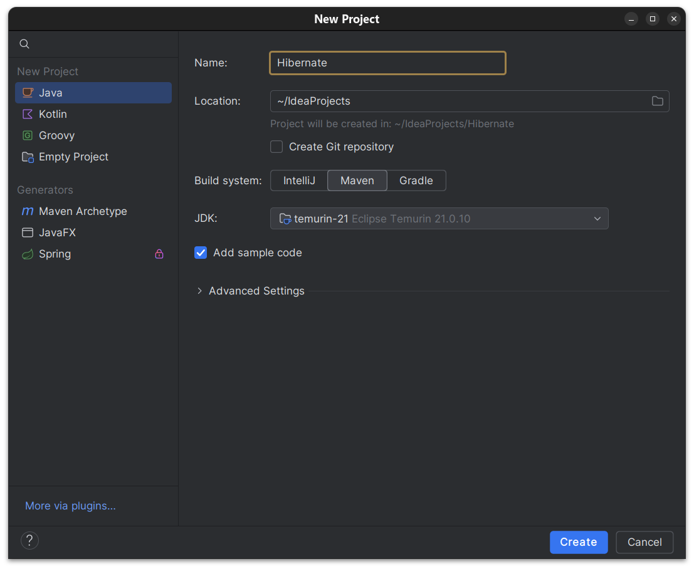
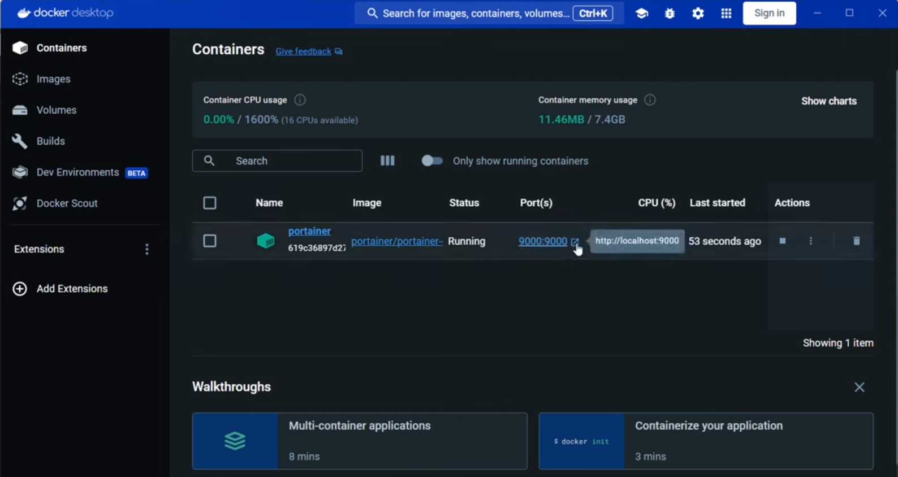
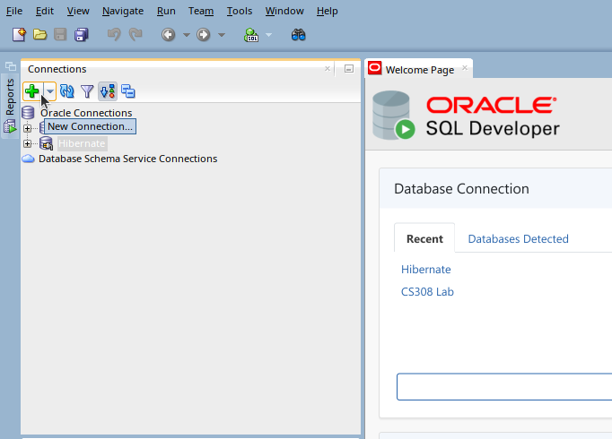
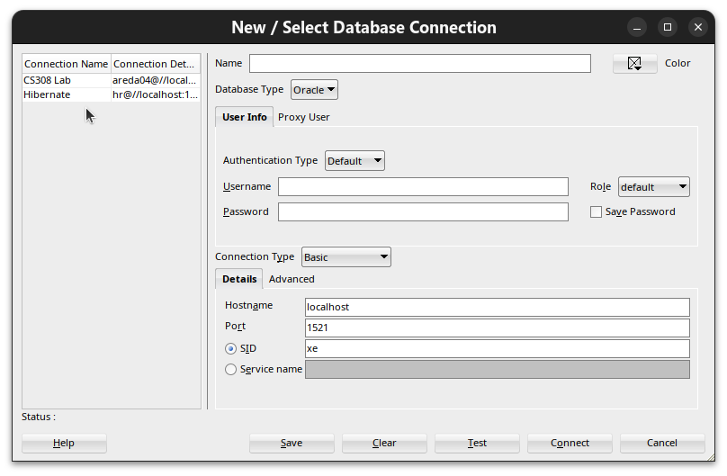
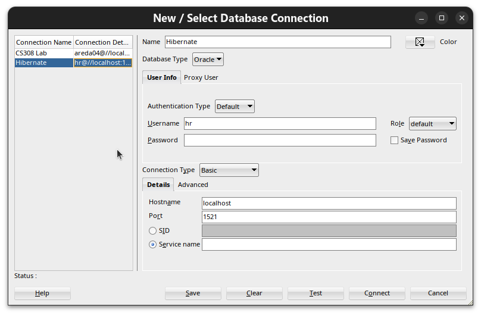
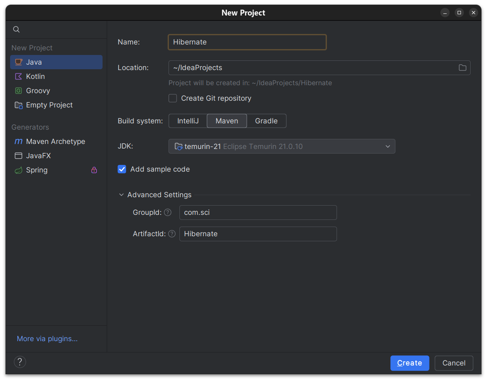
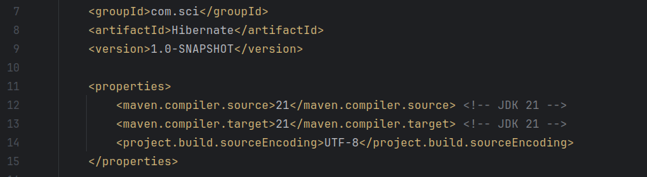
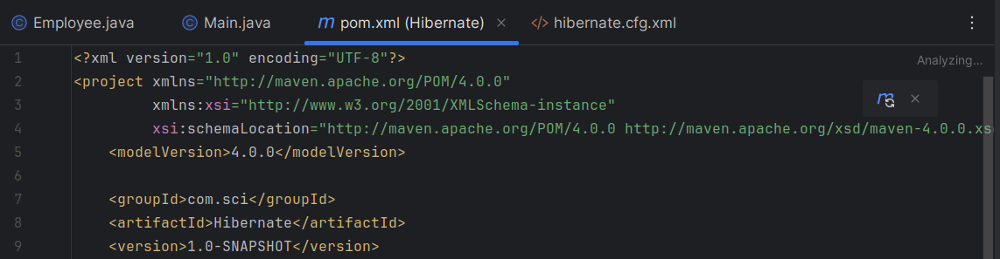
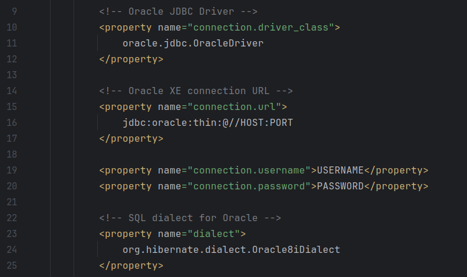

# Hibernate Setup Guide on IntelliJ IDEA (For CS308 Course)

---

## Disclaimer

- This guide is for **educational purposes only** (i.e., studying/training) — do not use it in production.

```c
#include <std_disclaimer.h>
/*
 * I am not responsible for bricked software, dead SSDs, non-genuine OSes,
 * thermonuclear war, or you getting fired because the alarm app failed. Please
 * do some research if you have any concerns about applying this to your project.
 * YOU are choosing to make these modifications, and if
 * you point the finger at me for messing up your project, I will ignore it.
 */
```

---

## Requirements

- IntelliJ IDEA (any version)
- Internet connection (for downloading Maven repositories)
- Java 8 through 21 (JDK 22 and above are **not** supported)
- A valid Oracle Database XE (**Docker version only** is supported)
- SQL Developer (for adding the database schema and connecting a user)
- Some patience to get the setup working

---

## Setup Steps

### Step 1: Configure JDK, IntelliJ IDEA, Oracle Container & SQL Developer

#### a) Verify your JDK version (must be 8 through 21)

Check your version by opening a terminal (Linux/macOS) or Command Prompt (Windows) and running:

````
java --version
````

or

````
java -version
````

Expected output:

````
openjdk 21.0.10 2026-01-20 LTS
OpenJDK Runtime Environment Temurin-21.0.10+7 (build 21.0.10+7-LTS)
OpenJDK 64-Bit Server VM Temurin-21.0.10+7 (build 21.0.10+7-LTS, mixed mode, sharing)
````

This confirms you are running OpenJDK 21.

- If your JDK is **22 or later**, you must install JDK 21 or lower (JDK 17 is recommended).
  - **Windows / macOS:** Download from [Oracle Java SE Development Kit 17.0.12](https://www.oracle.com/java/technologies/javase/jdk17-archive-downloads.html) and install it.
  - **Linux (Ubuntu/Debian):** Run `sudo apt install openjdk-17-jdk -y` in the terminal.

#### b) Verify that IntelliJ IDEA supports Maven projects

Go to `File → New → Project → Build System` and confirm that **Maven** appears as an option and your JDK is one of JDKs 8 through 21 (as shown in the screenshot below).



#### c) Start your Oracle Docker container and note the host and port

**On Linux / macOS:**

After starting your Oracle container, run:

````
sudo systemctl status docker
````

In the output, look at the `CGroup:` section:

````
     ........
      Tasks: 46
     Memory: 67.5M (peak: 126.0M)
        CPU: 960ms
     CGroup: /system.slice/docker.service
             ├─13405 /usr/bin/dockerd -H fd:// --containerd=/run/containerd/containerd.sock
             ├─13707 /usr/bin/docker-proxy -proto tcp -host-ip 0.0.0.0 -host-port 1521 -container-ip 172.17.0.2 -container-port 1521 -use-listen-fd
             ├─13714 /usr/bin/docker-proxy -proto tcp -host-ip :: -host-port 1521 -container-ip 172.17.0.2 -container-port 1521 -use-listen-fd
             ├─13729 /usr/bin/docker-proxy -proto tcp -host-ip 0.0.0.0 -host-port 5500 -container-ip 172.17.0.2 -container-port 5500 -use-listen-fd
             └─13735 /usr/bin/docker-proxy -proto tcp -host-ip :: -host-port 5500 -container-ip 172.17.0.2 -container-port 5500 -use-listen-fd
     ........
````

From the second branch in `CGroup`:
- After `-host-ip`: **host** = `0.0.0.0` (equivalent to `localhost`)
- After `-host-port`: **port** = `1521`

**On Windows:**

Open Docker Desktop, start your Oracle container, then click **Containers** in the left menu. Hover over the arrow under the **Port(s)** column for your Oracle container (as shown in the screenshot).



Example output: `http://localhost:9000`
- **host** = `localhost`, **port** = `9000`

#### d) Retrieve your SQL Developer username and password

Open SQL Developer and click the **+** button in the top-left corner.



From the left menu, select any connection whose credentials you remember.



Note your username and password from the connection details.



In this example: **username** = `hr`, **password** = `hr`.

> **Note:** If you have forgotten your password, you must create a new user via `SQL*Plus`. This is your own responsibility.

---

### Step 2: Create a Maven Project in IntelliJ IDEA

Maven will automatically manage all Hibernate dependencies.

1. Go to `File → New → Project`.
2. Select **Maven** as the build system and choose **Java 21**, **Java 17**, or whichever valid JDK version you have.
3. Click **Advanced Settings** and set:
   - `GroupId`: `com.sci`
   - `ArtifactId`: `Hibernate`
4. Set `Name` and `Location` as you prefer, and confirm your settings match the screenshot below.



> **Note:** After completing this step, verify that the Maven project SDK is set to your valid JDK via `File → Project Structure → Project SDK`.

---

### Step 3: Add Dependencies to `pom.xml`

1. Replace the contents of `pom.xml` in your project directory with the provided [pom.xml](pom.xml).
2. Confirm that `<groupId>` is `com.sci` and `<artifactId>` is `Hibernate`.

**Dependency overview:**
- `hibernate-core` — the ORM engine that maps Java classes to SQL tables.
- `ojdbc8` — the Oracle JDBC thin driver for connecting to Oracle XE.
- `hibernate-ehcache` — enables second-level (L2) cache shared across sessions.
- `lombok` — `@Data`, `@NoArgsConstructor`, and `@AllArgsConstructor` generate boilerplate code automatically.

3. Confirm that `<maven.compiler.source>` and `<maven.compiler.target>` match your JDK version (e.g., `17` for JDK 17, `21` for JDK 21), as shown below.



4. Install the **Lombok** plugin via `File → Settings → Plugins → Marketplace` and search for "Lombok".
5. Enable annotation processing under `File → Settings → Build → Compiler → Annotation Processors`.
6. Click the blue Maven refresh icon (top-right) or press `Ctrl+Shift+O` to download all dependencies.



---

### Step 4a: Create `hibernate.cfg.xml` (Main Hibernate Configuration File)

1. Navigate to `src/main/resources/` and create `hibernate.cfg.xml` there.
2. Paste the contents of [hibernate.cfg.xml](src/main/resources/hibernate.cfg.xml) into the file.

**Property overview:**
- `connection.url` — connects to Oracle XE running locally on the specified port.
- `dialect` — tells Hibernate which SQL flavor to generate (Oracle-specific syntax).
- `show_sql = true` — prints every generated SQL statement to the console (useful for debugging).
- `enable_lazy_load_no_trans` — allows lazy-loaded relationships to be accessed even after the Session closes.
- `<mapping class="…"/>` — you must add one line per `@Entity` class you create.

---

### Step 4b ⚠️ IMPORTANT: Update `hibernate.cfg.xml` with Your Credentials

1. Open `src/main/resources/hibernate.cfg.xml`.
2. Refer to the screenshot below.



Using the values obtained from **Step 1**:

| Placeholder | Example value |
|-------------|---------------|
| `HOST`      | `localhost`   |
| `PORT`      | `1521`        |
| `USERNAME`  | `hr`          |
| `PASSWORD`  | `hr`          |

Make the following replacements:
1. In `<property name="connection.url">` (**Line 16**), replace `HOST` with your host and `PORT` with your port.
2. In `<property name="connection.username">` (**Line 19**), replace `USERNAME` with your username.
3. In `<property name="connection.password">` (**Line 20**), replace `PASSWORD` with your password.

---

### Step 5: Create `DBConfig.java` (SessionFactory)

1. Navigate to `src/main/java/com/sci/`, create a folder named `util`, and create `DBConfig.java` inside it.
   - Full path: `src/main/java/com/sci/util/DBConfig.java`
2. Paste the contents of [DBConfig.java](src/main/java/com/sci/util/DBConfig.java) into the file.

**Notes:**
- `SessionFactory` is created once and shared across all threads — it holds the connection pool and the L2 cache.
- `Session` is opened per unit of work (short-lived; **not** thread-safe).
- Always call `DBConfig.shutdown()` before the JVM exits to release connections cleanly.

---

### Step 6: Create `Employee.java` (Entity Class)

1. Navigate to `src/main/java/com/sci/`, create a folder named `models`, and create `Employee.java` inside it.
   - Full path: `src/main/java/com/sci/models/Employee.java`
2. Paste the contents of [Employee.java](src/main/java/com/sci/models/Employee.java) into the file.

**Annotation overview:**
- `@Entity` — marks this class as a Hibernate-managed persistent entity.
- `@Table(name, schema)` — maps to the exact table and schema in Oracle.
- `@Id` — designates the primary key field.
- `@GeneratedValue(strategy = SEQUENCE)` — uses an Oracle sequence for auto-increment PKs.
- `@Column(name = "…")` — maps a field to a specific column name (snake_case in the DB).
- `@Cacheable + @Cache` — opts the entity into the L2 Ehcache.

---

### Step 7: Create `DBEmployee.java` (Data Access Object / DAO Class)

1. Navigate to `src/main/java/com/sci/`, create a folder named `dao`, and create `DBEmployee.java` inside it.
   - Full path: `src/main/java/com/sci/dao/DBEmployee.java`
2. Paste the contents of [DBEmployee.java](src/main/java/com/sci/dao/DBEmployee.java) into the file.

**Notes:**
- `HQL`: `"FROM Employee"` uses the class name, not the table name — Hibernate translates it to SQL automatically.
- `try-with-resources`: `Session` implements `AutoCloseable`, so it closes automatically even on exception.
- `Transaction`: required for INSERT/UPDATE/DELETE; not needed for SELECT.
- `tx.rollback()`: always roll back on error to avoid partial writes.

---

### Step 8: Run Your First Query (Verify Your Setup)

1. Open `src/main/java/com/sci/Main.java`.
2. Paste the contents of [Main.java](src/main/java/com/sci/Main.java) into the file.

Expected output (all employees are listed, followed by the name of the employee with ID 100):

````
/usr/lib/jvm/temurin-21-jdk-amd64/bin/java ... com.sci.Main
Apr 27, 2026 6:17:36 PM org.hibernate.Version logVersion
INFO: HHH000412: Hibernate ORM core version 5.6.7.Final
Apr 27, 2026 6:17:37 PM org.hibernate.boot.jaxb.internal.stax.LocalXmlResourceResolver resolveEntity
WARN: HHH90000012: Recognized obsolete hibernate namespace http://hibernate.sourceforge.net/hibernate-configuration. Use namespace http://www.hibernate.org/dtd/hibernate-configuration instead. Support for obsolete DTD/XSD namespaces may be removed at any time.
...
Hibernate: select employee0_.employee_id as employee_id1_0_, employee0_.first_name as first_name2_0_, employee0_.last_name as last_name3_0_, employee0_.salary as salary4_0_ from hr.employees employee0_
Steven King
Neena Kochhar
...
Hermann Baer
Shelley Higgins
William Gietz
Found: Steven
Apr 27, 2026 6:17:40 PM org.hibernate.engine.jdbc.connections.internal.DriverManagerConnectionProviderImpl$PoolState stop
INFO: HHH10001008: Cleaning up connection pool [jdbc:oracle:thin:@//localhost:1521]
Process finished with exit code 0
````

- **Exit code 0** — setup is complete; Hibernate is working correctly. ✅
- **Exit code 1** — an error occurred. Double-check your `username`, `password`, `port`, and `host` values in `hibernate.cfg.xml`. ❌

---

*Made by [@areda04](https://github.com/areda04) — Good luck!*
